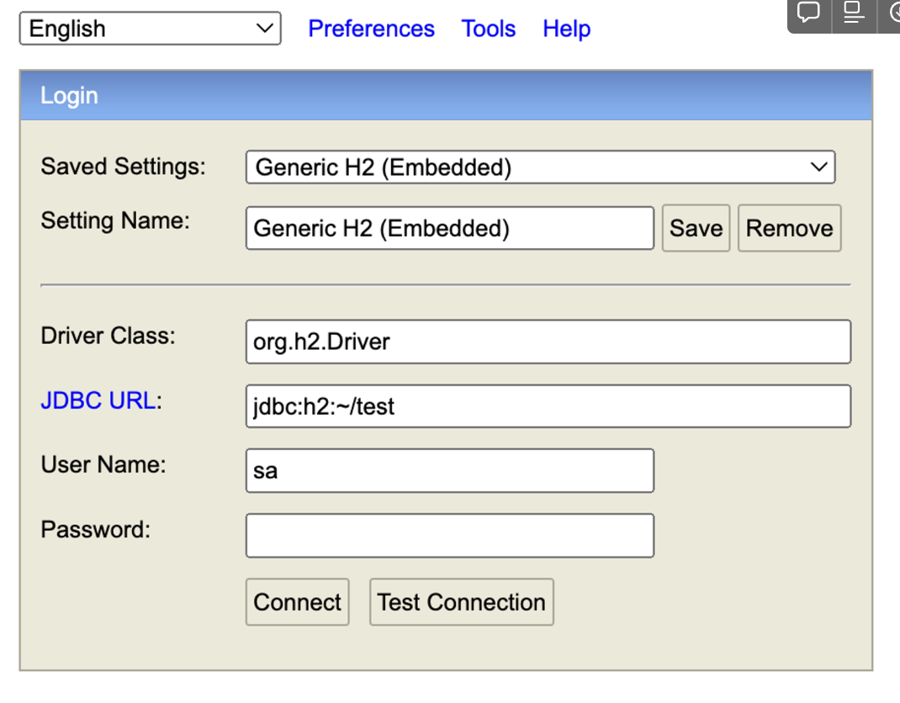
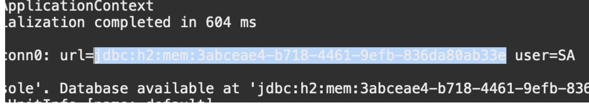

# 준비과정 - springboot project with H2 db

# 뭘 배울건데?

이번 **3. JPA, Hibernate - with Spring,Springboot**에서는 앞서 배운 Spring프레임워크와 Springboot 프레임워크를 기반으로, 여러 프레임워크로 **데이터베이스**를 다루는 법을 배울 것이다.

- 준비과정
    - H2 database를 사용하는 springboot project를 만들 것
    - COURSE table을 H2 db에 만들 것

- DB를 다루는 여러 프레임워크들 - 편리함에 따른 발전
    - Spring JDBC
    - **JPA** and Hibernate
    - Spring Data JPA

# H2 db 콘솔 연결하기 및 H2 db에서 테이블 생성하기

## H2 db 콘솔 연결하기

### H2 db - 동적 url 만들기

1. H2 db와 연결하는 방법 - application.properties에서 property 설정!

```java
// application.properties
spring.h2.console.enabled = true
```
2. 자바 코드를 실행하고, http://localhost:8080/h2-console에 들어가면,



다음과 같은 화면이 보인다.

3. 콘솔창에 랜덤 생성되는 url을 긁어와서, 로컬 서버에 JDBC URL에 붙여넣은 다음, connect 버튼 누르기 

-> connect 누르면, H2 콘솔로 연결 가능!



### H2 db - 정적 url 만들기

앞선 방법은 매번 실행될 때마다 랜덤 생성되는 JDBC url을 복사해서 붙여넣는 방법이었다면, 이 방법은 정해진 url을 만드는 방법이다.

1. application.properties에 다음과 같은 코드 추가

```java
spring.h2.console.enabled = true

// 코드 추가
spring.datasource.url = jdbc:h2:mem:testdb
```

2. 앞선 동적 url과 같은 방식으로 application.properties에 정한 url을 복사해, 로컬서버의 JDBC url(jdbc:h2:mem:testdb)에 붙이고 -> connect 버튼 누르기

## H2 db table 만들기

- src/main/resources 폴더 아래에 schema.sql 파일 만들기

- schema.spl 코드

```sql
create table course 
(
	id bigint not null, 
--	java long이랑 h2 db bingint형은 매칭된다.

	name varchar(255) not null,
	
	author varchar(255) not null,
	
	primary key (id)

);
```

로컬서버를 새로 고침하고, 해당 testdb 안에서 COURSE table이 생긴 것을 확인할 수 있음~~