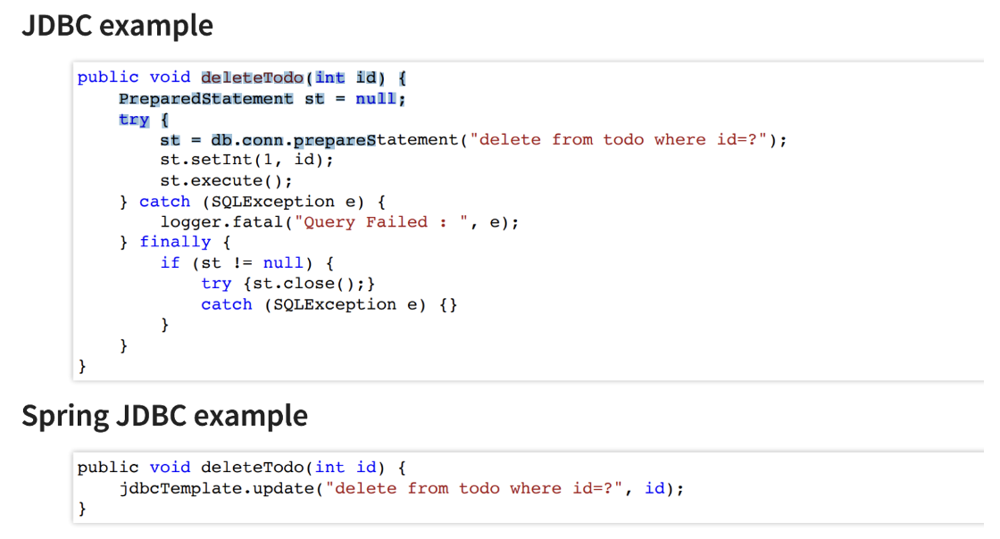

# Spring JDBC

앞선 포스팅에서는 준비과정으로 H2 database를 springboot project와 연동하고 sql문을 이용해 테이블을 만들었다.

앞으로의 포스팅에서는 db를 다루는 여러 프레임워크의 발달(JDBC -> Spring JDBC -> JPA -> Spring JPA)를 배울 것이다. **이번 포스팅**에서는, Spring JDBC에 대해 중점적으로 배워보자.

# 목차
- JDBC vs Spring JDBC

- Spring JDBC - "하드코딩"으로 데이터 삽입하기(insert)
    - JdbcTemplate 클래스, @Repository
    - CommandLineRunner 인터페이스
        - CommandLineRunner 인터페이스란?
        - 코드 설명 및 코드

- Spring JDBC - 데이터 삽입 및 삭제하기(insert, delete)
    - 앞선 과정에서 더나아가 함수에 파라미터 추가

- Spring JDBC - 데이터 select문

# JDBC vs Spring JDBC -> 편해짐!

스프링 프레임워크를 사용하기 전, JSP를 이용해 BBS 프로젝트를 만들었을 때를 상기해보자. 



다음과 같이, JDBC만으로는 굉장히 복잡한 코드를 써야 했다. 물론 Spring JDBC 또한 쿼리문을 써야 한다는 것은 똑같지만, 자바 코드가 굉장히 간결해진다는 점에서 굉장히 편해졌다는 사실을 확인할 수 있다!

이제 sql문을 Spring JDBC에서 어떻게 실행하는지, 그 방법에 대해 살펴보자

# Spring JDBC - "하드코딩"으로 데이터 삽입하기(insert)

## JdbcTemplate 클래스, @Repository

H2 DB의 course테이블과 연결할 클래스를 만들어야 한다.

아래 코드는 **@Repository**와 **JdbcTemplate클래스**를 이용해, 데이터베이스와 클래스를 연결하고, insert함수를 정의한 CourseJdbcRepository 클래스이다.

**@Repository**는 spring-annotation-sterotype에서도 언급한 세부화된 @Component으로, 데이터베이스와 연결될 때 주로 쓰인다. 또한, Spring jdbc를 이용해서 sql문을 실행하고 싶을 때 쓰는 클래스가 **JdbcTemplate** 클래스이다.

실제 코드를 살펴보자.

```java
@Repository
public class CourseJdbcRepository {

    @Autowired
    private JdbcTemplate jdbcTemplate;

    private static String INSERT_QUERY = """
        insert into course (id, name, author)

        values (1, 'spring', 'minji');
        """;
    
    public void insert(){
        jdbcTemplate.update(INSERT_QUERY); // sql문 실행 담당
    }

        /*
        * 
         update() 정의 긁긁 Issue a single SQL update operation (such as an insert, update or
        * delete statement) using a PreparedStatementCreator to provide SQL and any
        * required parameters.
        * 
        */
}
```

## CommandLineRunner 인터페이스

앞선 CourseJdbcRepository클래스에서 db를 연결하고, insert문 함수를 만들었다면, 이제 실제로 웹 어플리케이션 실행을 할 차례이다.

어플리케이션이 **시작할 때**, 위의 insert쿼리문을 실행하고 싶다면, Springboot에서 제공해주는 **CommandLineRunner** 인터페이스를 사용하면 된다.

### CommandLineRunner 인터페이스란?

정의는 다음과 같다.

Interface used to indicate that **a bean should run when** it is contained **within a SpringApplication.**

즉, bean이 SpringApplication 안에 포함될 때 실행된다는 의미다. 앞서 만든 CourseJdbcRepository에서도 @Repository를 통해 스프링 빈이 만들어진 것을 확인할 수 있었다. 이 bean이 SpringApplication 안에 있으니, 해당 CourseJdbcRepository클래스가 실행된다는 의미다.

이처럼, **Spring 어플리케이션 시작 시, 실행해야 할 로직이 있을 때**, CommandLineRunner를 사용하면 유용하다.

### 코드 설명 및 코드

```java

@Component
public class CourseJdbcCommandLineRunner implements CommandLineRunner {

    @Autowired
    private CourseJdbcRepository repository;

   	@Override
	public void run(String... args) throws Exception {
		repository.insert();
	}
}
```

# Spring JDBC - 데이터 삽입 및 삭제하기 (insert, delete)

앞선 과정에서 기본적인 흐름을 배웠으니, (@Repository, JdbcTemplate, CommandLineRunner) 앞선 코드에서 조금 더 발전시켜서 insert 메서드 안에 파라미터가 들어갈 수 있게끔 코드를 짜보자.

- CourseJdbcRepository 클래스 & Course클래스 - insert함수에 Course클래스를 받는 파라미터 추가(CourseJdbcRepository 클래스)
    <details>
      <summary>CourseJdbcRepository 클래스</summary>
      
      ```java
        @Repository
        public class CourseJdbcRepository {

        @Autowired
        private JdbcTemplate jdbcTemplate;

        private static String INSERT_QUERY = """
            insert into course (id, name, author)

            values (1, 'spring', 'minji');
            """;
        
        // 파라미터 추가
        public void insert(Course course){
            jdbcTemplate.update(INSERT_QUERY); // sql문 실행 담당
        }

        }
      ```
    </details>

     <details>
      <summary>Course 클래스</summary>
      
      ```java
        public class Course {

        private long id;
        private String name;
        private String author;

        // constructors

        public Course() {

        }

        public Course(long id, String name, String author) {
            super();
            this.id = id;
            this.name = name;
            this.author = author;
        }

        // getters
        public long getId() {
            return id;
        }

        public String getName() {
            return name;
        }

        public String getAuthor() {
            return author;
        }

        // toString
        @Override
        public String toString() {
            return "Course [id=" + id + ", name=" + name + ", author=" + author + "]";
        }

    }
      ```
    </details>

- 이제 Course클래스에서 CourseJdbcRepository클래스로 값들을 넘겨주고 싶다.
    - jdbc - preparedStatement에서 한 것처럼 sql문을 ?로 써준다.

    - JdbcTemplate - 오버로딩된 update메서드 - ?에 대응하는 파라미터값 넘겨주기

    - CourseJdbcCommandLineRunner - insert함수에서 Course객체 만들어 넘겨주기

    <details>
      <summary>수정된 코드 모음</summary>
      
      ```java
        // CourseJdbcRepository.java
        @Repository
        public class CourseJdbcRepository {

            @Autowired
            private JdbcTemplate JdbcTemplate;

            private static String INSERT_QUERY = """
                    insert into course (id, name, author)

                    values (?, ?, ?);
                    """;

            public void insert(Course course) {
                JdbcTemplate.update(INSERT_QUERY,

                        course.getId(), course.getName(), course.getAuthor());

            }
        }

        // CourseJdbcCommandLineRunner.java
        @Component
        public class CourseJdbcCommandLineRunner implements CommandLineRunner {

            @Autowired
            private CourseJdbcRepository repository;

            @Override
            public void run(String... args) throws Exception {
                repository.insert(new Course(2, "db", "minji2"));

            }

        }
      ```
    </details>

앞선 insert함수 말고, delete함수를 만들어, spring jdbc 프레임워크를 이용해보았다!

<details>
    <summary>추가된 코드들</summary>

    ```java
    // CourseJdbcRepository 

    @Repository
    public class CourseJdbcRepository {

        @Autowired
        private JdbcTemplate JdbcTemplate;

        private static String INSERT_QUERY = """
                insert into course (id, name, author)

                values (?, ?, ?);
                """;

        private static String DELETE_QUERY = """
                delete from course where id = ?;
                """;

        public void insert(Course course) {
            JdbcTemplate.update(INSERT_QUERY,

                    course.getId(), course.getName(), course.getAuthor());

        }

        public void delete(int id) {
            springJdbcTemplete.update(DELETE_QUERY, id);
        }
    }

    // CourseJdbcCommandLineRunner

    @Component
    public class CourseJdbcCommandLineRunner implements CommandLineRunner {

        @Autowired
        private CourseJdbcRepository repository;

        @Override
        public void run(String... args) throws Exception {
            // TODO Auto-generated method stub
            repository.insert(new Course(2, "db", "minji2"));
            repository.insert(new Course(3, "java", "minji3"));
            repository.insert(new Course(4, "spring", "minji4"));

            repository.delete(2);

        }

    }
    ```  
</details>

이처럼, BBS 개인 플젝 만들 때, jdbc로 많은 코드를 작성하는 것보다 훨씬 간결한 spring JDBC 프레임워크 코드를 확인할 수 있었다!

# Spring JDBC - 데이터 select문