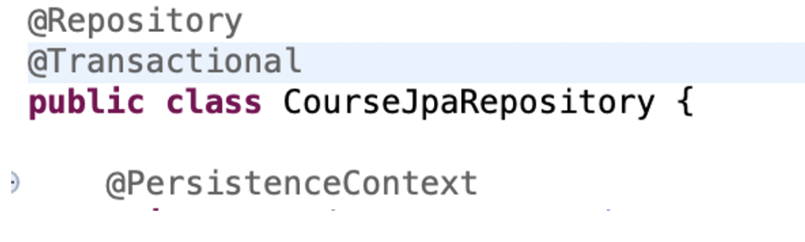
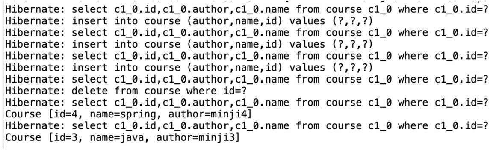

# JPA

계속해서 데이터베이스를 다루는 여러 프레임워크를 정리하며, 점점 편리해지는 과정을 보았다.

JDBC -> Spring JDBC의 변화에서는, 자바 코드는 간단하게 변했지만 쿼리문이 복잡한 것을 확인할 수 있었다. 만일, 쿼리문이 1만개라면? 점점 더 쿼리 작성이 복잡해질 것이다..

그렇기에, 더이상 쿼리문을 작성하지 않고 데이터베이스를 다루는 자바기반 프레임워크인 **JPA**가 등장했다!

JPA를 한마디로 정리하자면, **"JUST Map Entities TO Tables"**이다!

# 목차
- @Entity 등장 (이론)

- JPA와 EntityManager 시작하기 (실제 방법)
    - Entity define - @Entity, @Id(primary key 설정), @Column
    - Entity 활용할 레포지토리 클래스 - @Repository, EntityManager클래스, @PersistenceContext
    - deleteById, findById 메서드 기능을 Spring JPA를 이용해서 만들자
    - CourseCommandLiner클래스 - @Transactional 어노테이션 및 결과 출력

# @Entity 등장 (이론)

JPA의 @Entity를 활용하게 되면, **자바 객체**와 데이터베이스의 **테이블** 간의 directly mapping을 할 수 있다.

계속 썼던 예제로 말하자면, db의 course테이블의 id, name, author속성과 Course클래스의 멤버변수 id, name, author끼리 directly mapping을 할 수 있다는 것이다!

이제 실제로 JPA를 이용해보자.

# JPA와 EntityManager 시작하기 (실제 방법)

## Entity define - @Entity, @Id(primary key 설정), @Column

자바 코드 - **@Entity**와 database - **Table** 사이의 매핑에 주목!

```java
import jakarta.persistence.Column;
import jakarta.persistence.Entity;
import jakarta.persistence.Id;

@Entity // @Entity(name = "Course_Details") - 만일 지금과 달리, 자바 객체와 db의 테이블명을 달리하고 싶다면
public class Course {

    @Id // primary key
    private long id;

    @Column(name = "name") // db의 name속성과 매핑된다는 의미
    private String name;

    @Column(name = "author")
    private String author;
}
```


## Entity 활용할 레포지토리 클래스 - @Repository, EntityManager클래스, @PersistenceContext

```java
// Spring JPA - insert 기능 

@Repository
public class CourseJpaRepository {

    @PersistenceContext
    private EntityManager entityManager;

    public void insert(Course course){
        entityManager.merge(course);
    }
}
```

- JPA를 이용해 데이터베이스에 연결하려면, **EntityManager**를 만들어, 엔디티를 관리해야 한다.
    - 이미 앞에서 Entity를 define할 때, 자바 엔디티랑 디비의 테이블 속성들이 잘 매핑이 되어 있으니, EntityManager로 이미 매핑된 속성들에 merge메서드를 통해 course객체를 insert할 것 

- @Autowired 대신 **@PersistenceContext**
    - 정의 긁긁 <br>
    Expresses a dependency on a container-managed **EntityManager** and its associated persistence context <br>
    컨테이너 관리형 EntityManager 및 그에 관련된 영속성 컨텍스트와의 의존성을 나타낸다. <br>
    Autowired보다 더 구체적인 어노테이션 (마치, Component, Repository 관계 같다.)


## deleteById, findById 메서드 기능을 Spring JPA를 이용해서 만들자

```java
// method이름은 이전에 생성한 것과 같은데 안에 body문만 바뀜

@Repository
public class CourseJpaRepository {

	@PersistenceContext
	private EntityManager entityManager;

	public void insert(Course course) {
		entityManager.merge(course);
	}

	public Course findById(int id) {
		return entityManager.find(Course.class, id); // Course.class에서 id를 통해 찾아내자
	}

	public void deleteById(int id) {
		Course course = entityManager.find(Course.class, id);
		entityManager.remove(course);
	}
}
```

- insert기능은 EntityManager에서 제공하는 merge메서드를 통해
- select와 delete기능은 EntityManager에서 제공하는 find메서드와 remove메서드를 통해

## CourseCommandLiner클래스 - @Transactional 어노테이션 및 결과 출력

근데 위의 변경사항만 적용하니, 에러가 났다. 

JPA로 쿼리를 실행할 때마다 **트랙잭션**을 허용해야 하는데, 이때 필요한 것이 @Transactional 어노테이션이다. 따라서, CourseJpaRepository에 @Transactional 어노테이션을 추가하자.



참고로, application.properties에 다음과 같은 코드를 추가하면, jpa를 실행하고 있을 때 생성된 모든 sql문 확인이 가능하다.

```java
spring.jpa.show-sql = true
```




# 결론, 한마디
이처럼, JPA를 이용하면 쿼리문을 작성할 필요없이, EntityManager의 메서드를 잘 쓰면 된다. 

그럼 이렇게 간단한 JPA를 두고, 왜 Spring Data JPA가 필요할까?

다음 포스팅에서 살펴보자.