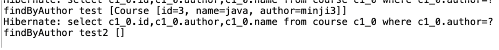

# Spring Data JPA

database를 다루는 여러 프레임워크를 발전순서대로 배워보았다. 아래의 3개의 프레임워크가 그것들이다.

많은 쿼리문과 많은 자바코드를 사용하는 **JDBC**

JdbcTemplate클래스와 CommandLineRunner를 사용해, 자바 코드를 간결하게 만든 **Spring JDBC**

@Entity와 @Id, @Column, EntityManager클래스를 사용해, 쿼리문을 없앤 **JPA**

하지만 이번 포스팅에서 정리할 **Spring Data JPA**는 훨씬 간결하다. 해당 내용을 정리해보자!

# 목차
- Spring Data JPA **기본**
    - 첫번째 코드 - CourseSpringDataJpaRepository.java
        - **JpaRepository 인터페이스**

    - 두번째 코드 - CourseCommandLineRunner.java
        - **JpaRepository에서 기본적으로 정의하는 메서드들**
            - save()
            - deleteById()
            - findById()
        - 수정된 두번째 코드

- Spring Data JPA 응용
    - 커스텀 메서드 설정

- JPA vs Hibernate


# Spring Data JPA 기본

## 첫번째 코드 - CourseSpringDataJpaRepository.java

Spring Data JPA는 주로 **JpaRepository** 인터페이스를 사용한다. 

먼저 해당 인터페이스 코드를 먼저 본 뒤, 그 후에 JpaRepository 인터페이스가 무엇인지 살펴보자.

```java
public interface CourseSpringDataJpaRepository extends JpaRepository<Course, Long> {

}
```

### JpaRepository 인터페이스

JpaRepository의 원형은 다음과 같다. (핵심만 잘랐다.)

```java
public interface JpaRepository<T, ID> 
```

이처럼, JpaRepository의 **첫 번째 매개변수**애서는 **어떤 Entity를 manage할지** 지정한다. 앞선 예시코드에서는 Course클래스(@Entity를 붙여둠)를 써두었다.

**두 번째 매개변수**는 **Entity의 식별자(ID)**를 나타낸다. 여기서 ID란 @Id로 지정해둔, Primary key를 의미한다. 앞선 예시코드에서는 Course 엔디티의 primary key 데이터타입을 Long으로 정의했다.

## 두번째 코드 - CourseCommandLineRunner.java

### JpaRepository에서 기본적으로 정의하는 메서드들 

JpaRepository인터페이스는 다양한 메서드들을 제공하는데, 그 중 일부를 정리해보겠다.

#### save()

- save메서드는 엔디티를 저장하거나 업데이트한다. 이미 존재하는 엔디티의 경우에는 업데이트를, 존재하지 않는 경우에는 새로운 엔디티를 저장한다.

```java
S save(T emtity); // S와 T는 제너릭한 함수에서 사용되는데, S는 리턴형, T는 파라미터에서 쓰인다.

repository.save(new Course(2, "db", "minji2"));
```

#### deleteById()

- deleteById메서드는 엔디티의 ID를 사용해 해당 엔디티를 삭제하는 메서드이다. 

```java
void deleteById(Id id);
```

여기서 ID는 엔디티에서 @Id로 정의한 primary key 속성의 타입과 동일해야 한다.

#### findById()

- findById메서드는 주어진 식별자(Id)에 해당하는 엔디티를 찾아 반환한다.

```java
Optional<T> findById(Id id); // Optional<T>는 자바 클래스로, 값이 존재할수도 안할수도 있는 상황을 나타내는 래퍼 클래스이다.

```
### 수정된 두번째 코드

```java

@Component
public class CourseCommandLineRunner implements CommandLineRunner {

//	@Autowired
//	private CourseJdbcRepository repository;

//	@Autowired
//	private CourseJpaRepository repository;

	@Autowired
	private CourseSpringDataJpaRepository repository;

    @Override
	public void run(String... args) throws Exception {
		// TODO Auto-generated method stub
		repository.save(new Course(2, "db", "minji2"));
		repository.save(new Course(3, "java", "minji3"));
		repository.save(new Course(4, "spring", "minji4"));

		repository.deleteById(2l);

		System.out.println(repository.findById(4l));
		System.out.println(repository.findById(3l));

	}
}
```

위 코드에서 l을 붙여 long타입을 명시했다는 사실을 볼 수 있다. JpaRepository에서 <Course, Long>으로 정의했기 때문

이처럼, Spring Data Jpa는 JpaRepository인터페이스와 해당 인터페이스에서 정의한 메서드들만 쓰면 되서, 훨씬 간단해진 코드를 관찰할 수 있었다!

------

# Spring Data JPA 응용

앞에서 Spring Data JPA의 기본뼈대를 배워보았다. 이번에는 Spring Data JPA에서 사용할 수 있는 기타 기능인 커스텀 메서드 설정을 살펴보자.

## 커스텀 메서드 설정

예를 들어보자. 

지금까지는 계속해서 id를 이용해 데이터베이스에서 검색을 수행했다. 하지만 이번에는 author 기준으로 검색을 하고 싶어졌다. 이를 어떻게 구현할 수 있을까?

함수 이름을 **findBy 다음에 클래스의 속성 이름이 나오도록** 지으면 된다.

```java
// CourseSpringDataJpaRepository.java
public interface CourseSpringDataJpaRepository extends JpaRepository<Course, Long> {
	List<Course> findByAuthor(String author);
}

// CourseCommandLineRunner.java에 다음과 같은 코드 추가

System.out.println("findByAuthor test " + repository.findByAuthor("minji3"));
System.out.println("findByAuthor test2 " + repository.findByAuthor(""));
```

실행결과는 다음과 같았다.



------

# JPA vs Hibernate

- JPA는 API로, specification(기술 명세)를 정의한다.
    - 뭘 정의하는데?
        - define entities - @Entity
        - define primary key - @Id
        - how do you map attributes - @Column
        - Who manages the entities - EntityManager

- Hibernate는 JPA의 유명한 구현체(implementations of  JPA)이다.