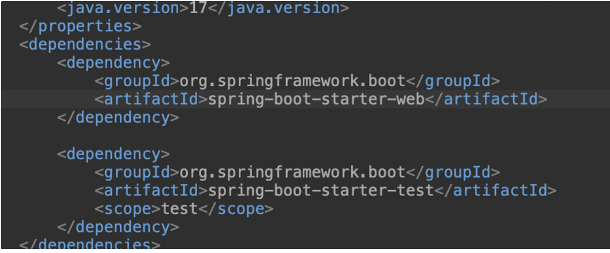
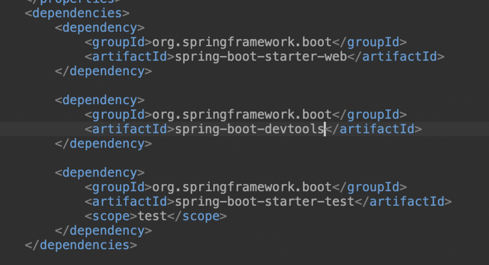

# springboot GOAL - 1. Build quickly

스프링부트를 잘 이해하려면, 스프링부트를 잘 다루는 방법뿐만 아니라 **스프링부트 백그라운드**에서는 무슨 일이 일어나고 있는지를 잘 파악해두어야 한다.

스프링부트는 주로, 웹 개발을 편리하게 하기 위해 만들어진 자바언어 기반의 프레임워크다. 

스프링부트의 목표는 크게 2가지라고 보면 된다.

- Build quickly
    - Spring initializer : start.spring.io 웹사이트에서 쉽게 만들 수 있음
    - Spring Boot Starter Project
    - Spring Boot Auto Configuration
    - Spring Boot DevTools

- production-ready
    - Logging
    - Differnt Configuration for Different Environments
        - Profiles, ConfigurationProperties
    - Monitoring(Spring Boot Actuator)

위의 내용을 두개의 포스팅에 걸쳐서 정리할 것이다.

# 목차

- Spring Boot Starter Project
- Spring Boot Auto Configuration
- Spring Boot DevTools

## 1. Spring Boot Starter Project

### starter Project의 필요성과 의미

어플리케이션의 기능을 build할 때마다 많은 프레임워크가 필요하다. 가령, REST API를 build하려면, Spring프레임워크, Spring MVC 프레임워크, tomcat 프레임워크, JSON conversion... 등등의 많은 프레임워크가 필요하다.

이러한 프레임워크를 그룹화해서, 어플리케이션을 쉽게 빌드하고자 만든 것이 바로, starter project이다. 

starter project의 뜻부터 먼저 말하자면, **define all application dependencies**이다.

그럼 이제 starter project를 실제로 사용해, 어플리케이션 의존성을 주입하는 방법을 살펴보자.

### starter project 사용법

- pom.xml에서 본 의존성 주입
    
    - spring-boot-starter-web으로 REST API와 웹 어플리케이션을 빌드할 수 있고,
    - spring-boot-starter-test로 UNIT TEST를 빌드할 수도 있다!

## 2. Spring Boot Auto Configuration

앞선 과정에서는 starter project를 통해 모든 의존성을 "정의"했었음.

하지만, 모든 의존성을 정의하는 것만으로는 충분하지 않다. 이제는 의존성 "자동" "주입"하는 과정이다.

스프링부트를 사용해 웹 어플리케이션을 빌드하고자 할때는 많은 설정(Configuration)들이 필요하다. 가령, ComponentScan, DispatcherServlet, Data Sources, JSON Conversion...

스프링부트에서는 Auto Configuration 기능을 통해, 위와 같은 수많은 설정들을 만드는 과정을 간소화시킨다.

스프링부트의 Auto Configuration 기능의 특징은 다음과 같다.
- Auto Configuration은 클래스 경로에 있는 프레임워크 종류나, 클래스, 제공된 기본 설정에 따라 결정된다.
- 자동화 설정 로직은 특정 jar파일에서 정의된다.
    - Maven dependencies -> spring-boot-autoconfigure.jar에서 확인가능하다.

## 3. Spring Boot DevTools

springboot를 사용하다보면, 다음과 같은 의문점이 든다. 왜 코드를 변경할 때마다, 수동으로 서버를 재시작해야 하는 걸까? 자동으로 서버를 다시 시작하고, 코드의 변경사항을 적용하면 안되는 걸까?

직접 실습을 통해 관찰해보자.

1. pom.xml에 devtools 의존성 주입
    

2. 1번 상황을 적용시켰더니,
    - 굳이 서버를 멈추고 나서 다시 시작 안 눌러도 되고, 그냥 계속 시작을 눌러도 되었다.
    - 코드를 수정하고 저장만 눌러도, 자동으로 서버에 변경사항이 적용되는 것을 확인할 수 있었다.

참고로, pom.xml에서는 모든 의존성을 정의하는데, pom.xml에서는 코드를 변경하면 서버를 수동으로 재설정해야 하지만, pom.xml을 제외한 모든 파일에서는 (devtools를 적용시켰다면) 서버를 수동으로 재설정할 필요가 없다.
