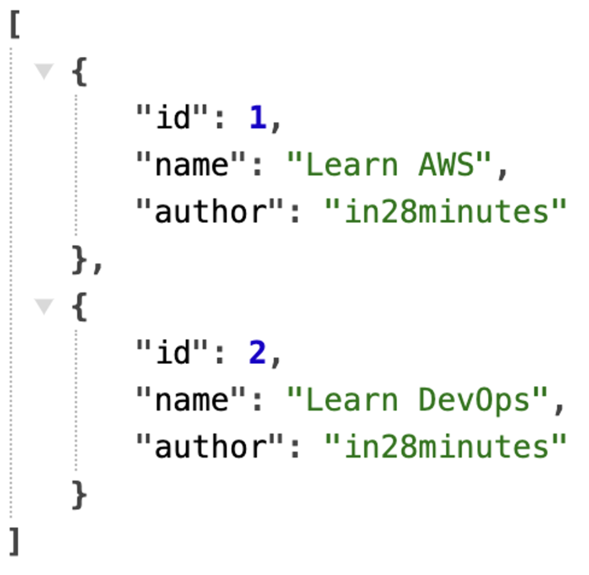

# REST API using springboot - @RestController, @RequestMapping

# 목차
- REST API랑 HTTP가 뭔데?
- REST API 만드는 방법
    - @RestController
    - @RequestMapping

# REST API랑 HTTP가 뭔데?

## REST API란??
REST == Representational State Transfer의 약어이다. 

REST API는 간단히 말하자면, **HTTP를 좀 더 효율적으로 쓰기 위해 구축한 시스템 스타일**이다. 이러한 특징으로 인해 REST API를 통해, **웹 어플리케이션에서 데이터를 전송하고 조작하는데** 널리 쓰이고 있다.

## HTTP란??
HTTP == Hyper Text Transfer Protocol의 약어이다.

HTTP는 **웹** 상에서 **브라우저와 서버가 데이터를 주고 받을 때 사용하는 프로토콜**이다. 이때, 프로토콜은 간단히 통신 규약으로, 데이터를 주고 받는 방식에 대한 규칙 정도로 이해하면 된다.

HTTP client는 서버에게 **HTTP request**를 보내고, HTTP server는 클라이언트의 요청 사항에 맞게 데이터를 구성해서, **HTTP response**를 통해 보낸 다음, 브라우저에 클라이언트의 요청 사항을 띄운다.

그외 HTTP 프로토콜의 특징을 간단히 정리하자면 다음과 같다. 그냥 간단히 참고만 하자.

- TCP/IP 통신 위에서 동작하며, 80번 포트를 사용한다.
- 어떤 종류의 데이터라도 전송 가능
    - HTML 문서, 단순 텍스트, 이미지, 오디오 등도 모두 가능
- Connectionless (비연결성)
    - Connectionless는 한 가지 요청에 대한 응답을 받으면, 그 연결을 끊어버리는 것을 의미한다. 연결에 대한 리소스를 줄일 수 있다는 장점이 있지만, 같은 클라이언트로부터 오는 요청도 계속 연결/해제해야 한다는 단점도 있다.
- ateless(무상태)
    - nectionless의 특징을 가지기에, 서버는 클라이언트를 식별하지 못한다. 따라서 같은 클라이언트에서 계속 요청을 보내더라도 그 요청은 각각 독립적으로 처리된다.

# REST API 만드는 방법 - 두 가지 어노테이션 사용

## 어떤 작업을 할건데?

누군가가 http://locatlhost:8080/courses 링크를 입력하면, 다음의 데이터를 반환해 화면에 보여주고 싶다.

JSON 파일 형식이다.


## @RestController와 @RequestMapping

다음의 어노테이션들은 후에 정리할 것이다. 
지금의 포스팅에서는 REST API를 이렇게 만드는 구나, 에 집중하는 포스팅이다.

- @RestController를 클래스 위에 붙여, 컨트롤러 지정
- @RequestMapping은 메서드 위에 붙여, 특정 URL과 특정 메서드를 매핑해준다.


```java
	/*
	 * http://localhost:8080/courses
	 * 
	 * { "id": 1, "name": "Learn AWS", "author": "in28minutes" }
	 * 
	 * ]
	 */

    @RestController
    public class CourseController {

        @RequestMapping("/courses")
        public List<Course> retriveAllCourses(){
            return Arrays.asList(
                new Course(1, "Learn AWS", "in28minutes"),
                new Course(2, "Learn DevOps", "in28minutes")
            );
        }
    }

    // Course.java
    public class Course {
        private long id;
        private String name;
        private String author;

        public Course(long id, String name, String author){
            this.id = id;
            this.name = name;
            this.author = author;
        }
    }
```

### 실행결과

http://localhost:8080/courses에 접근하면, 다음과 같은 JSON 응답이 반환되는 것을 확인할 수 있다.


