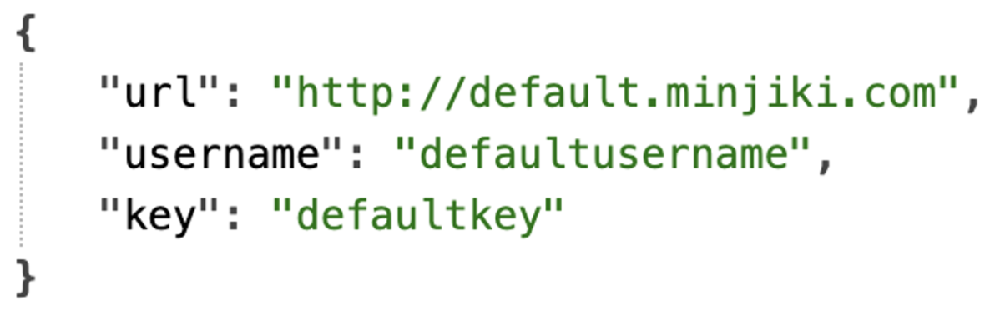
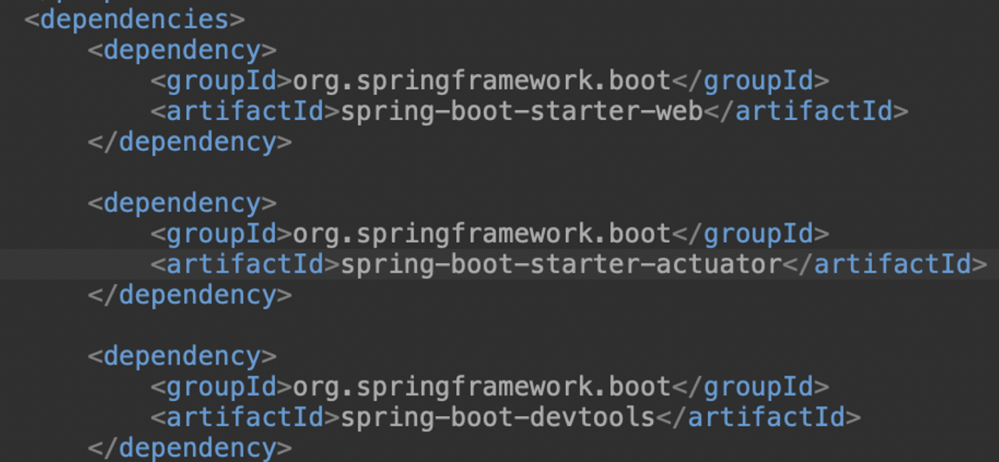

# springboot GOAL - 2. production-ready

앞선 포스팅에서는 스프링부트의 첫번째 목표인 build quickly를 정리해보았다.

이번 포스팅에서는 스프리부트의 두번째 목표인 production-ready 기능을 정리해보겠다.

# 목차
1. Managing App Configuration using **Profiles**
    - profile 적용 에제와 active profile 설정
    - 다양한 logging 수준

2. **@ConfigurationProperties**
    - @ConfigurationProperties란?
    - 예제
        - application.properties에서 값 설정
        - 어플리케이션 준비 - @ConfigurationProperties, @Component
        - 컨트롤러 만들기

3. **Embedded Server**

4. Monitor Applications using Spring Boot **Autuator** - 모니터링 과정
    - Autuator와 endpoint란?
    - endpoint

# 1. Managing App Configuration using Profiles

profile을 사용하면, 다양한 "환경"에 맞는 여러 "설정"이 가능해진다. 다시 말해, profile을 통해 환경**별** 설정을 제공할 수 있게 된다. 

이게 무슨 말일까?

어플리케이션에는 다양한 개발환경이 있으며(Dev, QA, Stage, Prod..), 각각의 **환경**에 맞는 여러 **설정**이 필요하다. 예를 들면, **환경**이 다르면 logging 수준(**설정**)도 달라야 한다. 바로 이 지점에서 **profile**이라는 기능이 등장했다.

각각의 환경에 맞는 각각의 설정을 만들기 위해 여러 profile을 만들 수도 있다. application-dev.properties, application-prod.properties, .. 등과 같은 이름을 지정해서 말이다.

## profile 적용 예제와 active profile 설정

다음의 예제를 보자. profile 설정과 active profile을 사용해, 활성 상태의 프로필을 설정할 수도 있었다.

- dev환경에서는 trace레벨의 logging 수준, prod환경에서는 info레벨의 logging 수준

```java
// application.properties
logging.level.org.springframework = debug

// application-dev.properties
logging.level.org.springframework = trace

// application-prod.properties
logging.level.org.springframework = info
```

- 아직까지는 profile을 사용하지 않았다.
    - profile을 사용하지 않았다면, 어플리케이션은 default-properties인 application.properties를 적용한다.

    즉, debug 수준의 logging이 실행된다.

- 이제, **profile 설정을 해보자**
    ```java
    // application.properties
    logging.level.org.springframework = debug
    spring.progiles.active = prod
    ```
    - 이처럼 특정 프로필을 활성화하면, 해당 프로필의 우선순위가 가장 높다.
    - 즉, prod의 logging 수준인 info가 출력된다.

## 다양한 logging 수준

참고로, 앞서 언급한 logging의 수준은 다음과 같다.

- trace - 로그에 있는 모든 정보 출력, 즉 trace를 설정하면 trace의 아래 수준인 debug, info, warning, error 모두가 다 출력됨

- debug - info보다 조금 더 많은 정보 출력

- info

- warning - error보다 조금 더 많은 정보 출력

- error - 오류와 예외만 출력 

- off - 실제로 전체 로깅을 끈다

# 2. @ConfigurationProperties

## @ConfigurationProperties란?

먼저 정의부터 살펴보자.

스프링부트의 어노테이션이다.

**외부의 configuration properties 값을 어플리케이션 클래스와 mapping하기 위해** 사용한다. 
- appliaction.properties에 하드코딩된 값을, 자바 메모리로 가져온다.

어떻게 쓰는지 예제를 통해 살펴보자.

## 예제

에를 들어 다음과 같은 상황이 있다고 생각해보자.

currency-service.url = <br>
currency-service.username = <br>
currency-service.key = <br>
이와 같이 서비스에 관련해 다양한 설정이 필요하다고 생각해보자.

**springboot를 사용해서, 어떻게 properties에 하드코딩한 값을 어떻게 특정 url의 브라우저화면에 띄울 수 있을까? properties값과 어플리케이션 클래스를 어떻게 매핑할 수 있을까?**

이와 같이, 어플리케이션 설정을 많이 만드는 경우, springboot에서는 **configuration properties**를 권장한다.

### application.properties에서 값 설정

```java
currency-service.url = http://default.minjiki.com

currency-service.username = defaultusername

currency-service.key = defaultkey
```

### 어플리케이션 준비 - @ConfigurationProperties, @Component

```java
@ConfigurationProperties(prefix = "currency-service")
@Component
public class CurrencyServiceConfiguration {

    private String url;
    private String username;
    private String key;
}
```

### 컨트롤러 만들기

application.properties에서 설정한 값과 CurrencyServieConfiguration클래스와의 매핑이 잘 작동하는지 확인하기 위해 다음과 같이 컨트롤러를 만들어보자.

```java
@RestController
public class CurrencyConfigurationController {

    @Autowired
    private CurrencyServiceConfiguration configuration;

    @RequestMapping("/currency-configuration")
    public CurrencyServiceConfiguration retriveAllCourses(){
        return configuration;
    }
}
```

- **왜 의존성 주입을 하는가?** 줄글로 잘 설명해놓음!!!!!!

CurrencyServiceConfiguration클래스에서 @Component를 통해 Bean을 만들었어. 객체를 만들었단 말이야.

CurrencyServiceConfiguration클래스에 @ConfigurationProperties를 통해 properties에 하드코딩된 url, username, key값들을 mapping했단 말이야. 해당 객체 안에 그런 url, username, key값들이 각각 http://default.minjiki.com, defaultusername, defaultkey으로 값들이 들어가있어.

그런 CurrencyServiceConfiguration인스턴스값을 return하려면, CurrencyServiceConfiguration클래스와 CurrencyConfigurationController클래스끼리를 서로 이어줘야 (==의존성을 주입시켜줘야), CurrencyConfigurationController에서 retriveAllCourses메서드를 불렀을 때, 해당 CurrencyServiceConfiguration인스턴스에 저장된 객체의 값들이 @RequestMapping에 정의된 "/currency-configuration"에 JSON 파일형식으로 떠오르겠지!!!


### 실행결과

http://localhost:8080/currency-configuration에서 다음과 같은 화면이 로드된다!



# 3. Embedded Server

springboot 이전에는, 어플리케이션을 배포할 때 자바 다운받고(jdk), tomcat 서버 다운받고.. 그렇게 따로따로 개발환경을 다 맞춘 다음 배포해야 했다.

하지만! springboot에서는 embedded server 이름 그대로, tomcat과 같은 WAS서버가 이미 JAR 파일에 포함되어 있어, 굉장히 편리하다. 즉, springboot에서는 java만 설치하면 된다. JAR file에 이미 웹 서버가 포함되어 있기에.

# 4. Monitor Applications using Spring Boot Autuator

## Autuator와 endpoint란?

프로젝트를 진행하다보면, 어플리케이션의 백그라운드에서는 무슨 일이 일어나는지 모니터링을 하고 싶을 때가 있다.

이때, springboot에서 제공하는 **Actuator**기능의 다양한 **endpoint**들을 통해 모니터링을 할 수 있다.

다양한 endpoint들은 다음과 같다.
- beans : 어플리케이션에 포함된 모든 스프링 빈 모니터링 가능
- health
- metrics
- mappings : details around request mappings

## 예제 - 모니터링 과정

1. pom.xml에서 spring-boot-starter-actuator 추가
    
2. ttp://localhost:8080/actuator 확인
    
    - by default, endpoint로는 health만 보임
        - 해당 href 링크로 들어가면 health 정보 모니터링 가능
    - 더많은 endpoints를 관찰하고 싶다면?
        - application.properties에서 다음과 같은 코드 추가
        ```java
        management.endpoints.web.exposure.include = *
        ```