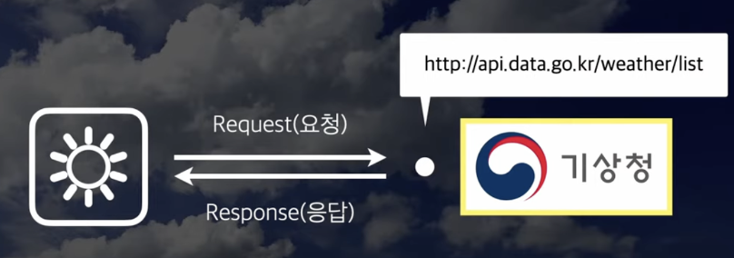
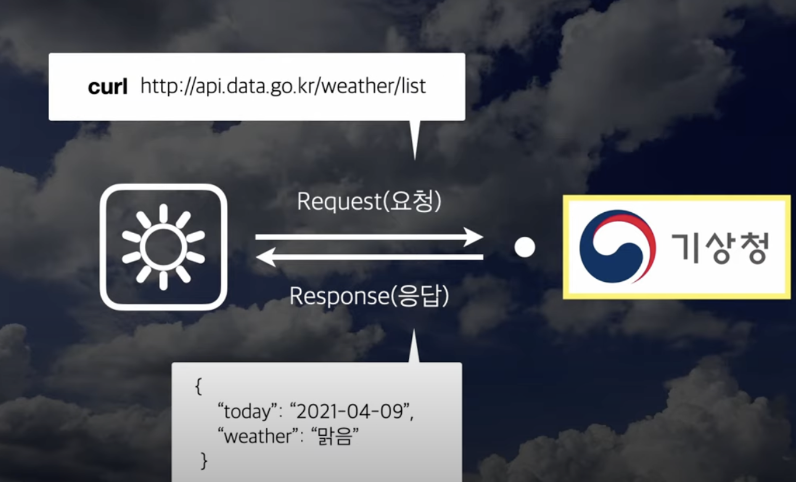
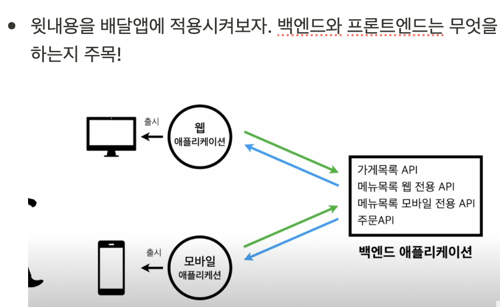

# API? HTTP API?

이 포스팅에서는 그동안 무심코 넘어갔던 여러 백엔드 관련 개발 용어들을 쉽게 정리해보도록 하겠다.

# 목차
- API의 사전적 정의
- Interface? UI?
- 다시 한번 API란?
- 기타 IT 용어들 - DB서버, API서버, 프론트앤드, 백앤드

## API의 사전적 정의부터 살펴보자

**A**pplication **P**rogramming **I**nterface

응용프로그램에서 사용할 수 있도록, **운영체제나 프로그래밍 언어**가 제공하는 기능을 제어할 수 있게 만든 인터페이스

하지만 이런 내용은 너무나 추상적이라서 잘 와닿지 않는다. 먼저 **Inteface**가 뭔지부터 살펴보자.

## interface? UI?

interface는 간단히 말하면 **소통하기 위한 접점**이다.

예를 들어보자. 스마트키의 열림 버튼을 누르면 차가 열리는 상황을 생각해보자. 해당 상황에서 **스마트키**는 사람과 자동차의 소통의 접점인 인터페이스라고 볼 수 있다. **또한**, 우리는 컴퓨터를 쓸 때 키보드를 쓴다. 이때, **키보드**가 사람과 컴퓨터의 인터페이스라고 볼 수 있다.

여기에서의 **소통**이란, 쉽게 말해 **읽거나 쓰는 행위**를 말한다. (read, write)

또다른 상황을 생각해보자. 내가 배달주문을 하기 위해 스마트폰에 있는 배달앱에 들어가 보이는 배달화면을 생각해보자. 배달화면에서는 갖가지 배달 주문목록, 즐겨찾기된 배달목록, 주문하기 버튼 등 다양한 화면을 볼 수 있다. 이때, **앱에 있는 모든 화면 또한 인터페이스**라고 한다. 

배달화면은 사용자에게 배달을 할 수 있게끔 소통을 제공해준다. 이처럼, **사용자가 사용하는 인터페이스를 특히, UI (User interface)** 라고 한다.

참고로, 앞선 예시에서의 스마트키와 키보드는 물리적인 UI, 배달화면은 소프트적인 UI, 웹을 통해 보여지면 웹UI, 모바일을 통해 보여지면 모바일 UI 등 다양한 UI들이 존재한다.

정리해보자면,
- interface : 소통하기 위한 접점
- UI : "사용자"가 소통하기 위한 접점

## 다시 한번, API란?

앞에서의 UI는 "사용자"가 소통하기 위한 접점이지만..

API는 **응용 프로그램**이 소통하기 위한 접점이다.

이때 **응용프로그램이란**, 운영체제에서 실행되는 모든 소프트웨어를 말한다. 예를 들면, 안드로이드 운영체제의 응용프로그램 - 메신저앱, 배달앱, 캘린더가 있고, 윈도우 운영체제의 응용프로그램 - 엑셀, 브라우저, 메모장 등이 있다.

다시 말해, **API는, 애플리케이션에서 데이터를 읽거나 쓰기 위해 사용하는 인터페이스 (read & write)**이다.

예를 들어, 우리 동네 날씨를 보여주는 웹을 만들어본다고 하자. 우리 동네 웹정보는 기상청에 있다. 이 날씨 정보를 얻기 위해서는 기상청에 **request**를 보내고, 기상청으로부터 **response**를 받은 후, 화면에 날씨 정보를 보여줄 수 있다. 이때, **날씨 정보를 얻을 수 있도록, 기상청에서 보여주는 소통의 접점 == API**라고 한다.

- 위 사진처럼, **기상청**에서 API를 제공해주면,

- 앱에서는 다음과 같이 request를 해서, 다음의 JSON 형식의 데이터를 response로 받아, 사용자에게 보여줄 UI를 만들 수 있다.

다음의 예시와 같은 형식의 API를 **HTTP API**라고 한다.

## 기타 IT 용어들 - DB서버, API서버, 프론트앤드, 백앤드

**기상청**에서는 동네날씨정보를 **DB서버**에 보관한다. 또한, 기상청에서는 날씨 관련 데이터를 다른 어플리케이션에서 가져갈 수 있도록 **API서버**에 보관한다.

반면, **날씨정보앱**에서는, 이런 API를 조회해, 사용자에게 보여줄 UI를 개발한다.

이때, 날씨정보앱처럼 데이터를 요청하는 앞단을 **프론트앤드**, 데이터를 제공하는 앞단을 **백엔드**라고 한다.

앞선 내용을 배달앱에 적용시켜보자. 백엔드와 프론트앤드의 역할에 주목해 살펴볼 것이다. 

- **백엔드**에서는 데이터를 조회, 저장할 수 있도록 다양한 **API**를 개발해두었다.
- 그러면, **프론트앤드**에서는 이러한 API를 이용해, 사용자에게 보여줄 UI를 개발한다.

이렇듯, 사용자는 UI를 통해 소통하고 어플리케이션은 API를 이용해 소통하는 것을 알 수 있다.

참고로 회사에서만 사용할 수 있는 등의 공개되지 않은 API는 **private API**, 공공에서 사용할 수 있는 API는 **public API (open API)**이다. 

youtube API, insta API, facebook API, kakao API 등등 다양한 API가 존재한다.