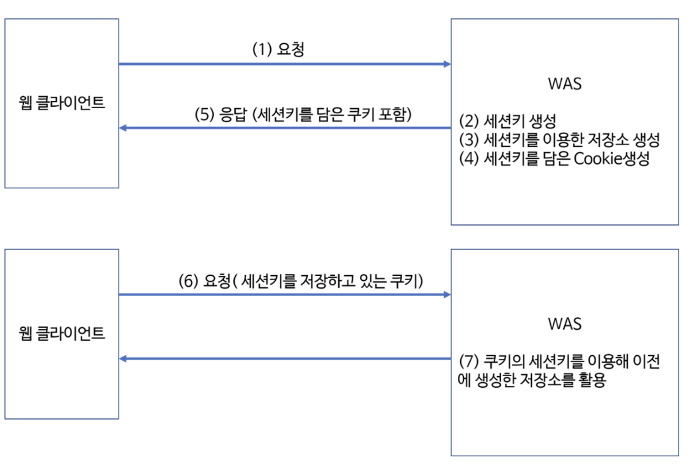

# 세션 관리

웹사이트에서 로그인이나 회원가입을 할 때, 로그인이나 회원가입 전후의 화면이 달라지는 것을 확인할 수 있다.

또, 로그인을 하고 일정시간이 지났는데도 해당 웹사이트에 로그인이 유지가 된다거나 혹은 유지가 안되서 다시 로그인을 해야 했던 경험도 있을 것이다.

이와 관련된 개념인 **세션 관리**에 대해 정리해보고자 한다.

# 목차
- 세션이란?

- 웹에서의 쿠키란?
    - 쿠키란?
    - 쿠키와 세션의 차이

- 세션 이용 흐름

- 세션 사용법 정리 
    - 5가지 메서드 소개 + 세션의 의미 다시금 상기

# 세션이란?

세션은 일정 시간동안 **사용자**가 **웹사이트**를 떠나지 않고 계속 상호작용할 수 있는 기간이다. 예를 들어, 로그인 후 사용자의 세션을 식별하기 위해 **서버**에서, 쿠키에 세션 식별자를 저장한다. 후에 세션 이용 흐름에서 이와 관련된 내용을 정리하겠다.

결론부터 말하자면, 세션은 **클라이언트와 서버 간의 상태 정보를 일정 기간 동안 유지하는 메커니즘**이며, 로그인 상태는 세션을 통해 관리되는 사용자의 일부 정보이다.

- 세션의 기간
    - 세션은 **일정시간동안 유지되는 사용자와 웹 서버간의 상태 정보**이다. 
    - 이 세션의 유지시간은 클라이언트가 웹 서버에 요청을 보낼 때마다 갱신된다.

- 세션 생성과 클라이언트의 구분
    - 일반적으로 세션은 클라이언트가 웹 서버에 최초로 접속할 때 **생성**된다. 
    - 세션은 **서버** 측에서 유지되며, **클라이언트**는 세션 식별자를 **쿠키** 등을 통해 받아 저장한다.
    - 세션 식별자를 통해, 서버는 각 클라이언트를 고유하게 식별한다.

- 로그인 상태와 세션
    - 로그인한 사용자의 정보는 세션에 저장될 수 있고, 세션을 통해 해당 사용자를 식별해낼 수 있다.

- 세션 만료와 식별
    - 세션은 일정 기간이 지나면 만료될 수 있다. 
    - 만일 사용자가 로그인한 상태에서 세션이 만료되면, 사용자는 다시 로그인해야 한다. 이때 서버는 새로운 세션을 생성해, 사용자를 식별한다.


# 웹에서의 쿠키란?

## 쿠키란?

쿠키는 웹사이트 접속 시, 접속자(클라이언트)의 개인장치에 다운로드되고, 브라우저에 저장되는 작은 텍스트 파일이다.

웹사이트는 쿠키를 통해 클라이언트를 식별하고, 접속자의 설정과 과거 이용 내역에 대한 일부 데이터를 저장해, 사용자 맞춤화된 웹사이트 활동을 가능하게 한다. 예를 들어, 로그인정보, 선호 설정, 장바구니 내용 등과 같은 사용자의 상태 정보를 쿠키에 저장해, 사용자를 식별하고 맞춤형 경험을 제공할 수 있다.

## 쿠키와 세션의 차이

쿠키는 앞서 정리한 세션의 개념과 비슷하다고도 느낄 수 있는데, 세션과 쿠키의 차이점은 다음과 같다.

**세션**은 **서버**에 저장되고, **쿠키**는 **클라이언트**에 저장된다. 따라서, 세션이 쿠키보다 보안에 더 강한 것이 사실이나, 무분별하게 사용되는 서버에 과부하를 줄 수도 있다.

대신, 쿠키는 클라이언트 pc에서 처리되기에 속도면에서 빨라질 수 있다.

# 세션 이용 흐름



1. 웹 클라이언트가 서버에게 request를 보내면, 서버는 클라이언트를 식별하는 **session id**를 생성한다. - **세션 식별자 (세션 ID)**

2. 서버는 생성한 **session id**로 key와 value값을 가지는 **HTTP session** 을 만든다. - 세션 식별자로 **세션** 만들기

    - 클라이언트가 서버에 최초로 접속하면, 서버는 고유한 세션 ID로 **HttpSession객체**를 생성한다. (뒤에 세션 사용법에 나온다.)

3. 서버는 session id를 가지고 있는 **쿠키**를 만들어 클라이언트에게 전송한다

    - 해당 쿠키를 받은 클라이언트는, 이 쿠키를 통해 세션 ID를 유지해, 사용자를 식별할 수 있다.

4. 클라이언트가 서버에 request를 보낼 때, **session id**를 가지고 있는 쿠키를 전송한다.
    
    - 클라이언트가 **이후**에 서버에 request를 보낼 때, 클라이언트는 자동으로 **이전**에 받은 세션 ID를 담은 쿠키와 함께 전송한다.

5. 서버는 클라이언트로부터 받은 쿠키의 session id로 HttpSession을 찾아, 사용자별로 맞춤화된 정보를 제공해준다.

    - 서버는 클라이언트로부터 받은 세션 ID로, 세션 데이터를 관리하는 HttpSession객체를 찾는다.

    - 이를 통해 서버는 클라이언트에 대한 고유한 세션 정보를 식별해, 세션에 저장된 데이터(로그인 정보, 장바구니, 고객 관심에 맞는 광고)를 읽거나 쓸 수 있다.


이처럼, 세션 관리 방식은 웹 어플리케이션에서 사용자 식별과 상태 유지를 가능케 하며, 다양한 기능을 제공해준다.

# 세션 사용법 정리

## jsp에서 아무것도 import하지 않고 session.getAttribute()와 같은 메서드를 사용할 수 있는 이유?

javax.servlet.http.HttpSession에서 세션 데이터를 다룰 수 있다.

session.setAttribute()메서드를 어떠한 import도 없이 JSP 파일에서 사용할 수 있는 이유는, JSP가 서블릿(Servlet) 코드로 변환되고, 서블릿 코드에는 세션에 값을 설정하고 가져오는 등의 다양한 기능을 하는 session 객체가 기본으로 제공되기 때문이다!

## 사용법 메서드 정리

### 1. 세션 생성 및 세션 가져오기 - getSession()

```java
HttpSession session = request.getSession();
HttpSession session = request.getSession(true);
```

- request.getSession()메서드는 서버에 생성된 세션이 있다면 해당 세션을 반환, 만약 없다면 새 세션을 생성해 반환한다.

- 디폴트 인수값이 true이다.

- 새롭게 생성된 세션인지는 HttpSession의 isNew() 메서드를 통해 알 수 있다.

```java
HttpSession session = request.getSession(false);
```

- 만약 인수값을 false로 설정하면, 이미 생성된 세션이 있을 때는 그 세션을 반환하지만, 없다면 null은 반환한다는 점에서 차이가 있다.

### 2. 세션에 값 설정하기 - setAttribute()

```java
setAttribute(String name, Object value)
```

#### 일반적인 사용법

- setAttribute는 HttpSession 객체 내 데이터를 저장할 때 사용한다. 이 메서드로 **세션에 데이터를 저장할 때**는 이름과 값이 쌍으로 저장된다. 이때, "이름"은 데이터를 식별하기 위한 key고, "값"은 저장하려는 데이터이다.

    - 일반적인 사용법은 다음과 같다.
    ```java
    HttpSession session = request.getSession(); // 현재 request의 세션을 가져온다.

    session.setAttribute("attributeName", attributeValue); // 세션에 데이터를 저장
    ```
    - attributeName은 세션에서, "데이터를 식별하는 키"이다.
    - attributeValue는 세션에 저장된 데이터이다.

#### 로그인과 setAttribute, 세션의 의미 상기

- 예를 들면 다음과 같다.

    - 사용자가 로그인 한 후, 사용자의 정보(값)를 세션에 저장할 수 있다.

    ```java
    HttpSession session = request.getSession();
    
    session.setAttribute("userID", "john_doe");
    sessoin.setAttribute("userRole", "admin");
    ```

    **세션 == 서버와 클라이언트 사이 유지되는 상태정보,** 라는 뜻이 와닿을 것이다. **세션이라는 일정시간 유지되는 서버와 클라이언트의 연결통로** **안**에, userID와 userRole이라는 **식별자**를 설정하고 userID에는 john_doe**값**을, userRole 안에는 admin**값**을 넣어두는 것이다.

    - 이후에는 해당 세션이 유지되는 한, 해당 세션을 통해 로그인한 사용자의 정보를 얻거나 변경할 수 있다.

    ```java
    HttpSession session = request.getSession();

    String userID = (String)session.getAttribute("userID");
    String userRole = (String)session.getAttribute("userRole");
    ```

### 3. 세션에 저장된 값 가져오기 - getAttribute()

앞 코드에 미리 등장했다. 

```java
getAttribute(String name);
```

- getAttribute로 세션에 저장된 식별자(name)에 해당하는 값(value) 조회 가능

- 리턴타입이 Object라서 형변환 필요

- 간단한 예는 다음과 같다.
    ```java
    String value = (String)session.getAttribute("name");
    ```

### 4. 세션 값 삭제하기 - removeAttribute(), invalidate()

```java
removeAttribute(String name)
```
- removeAttribute메서드로 name에 해당하는 세션 정보를 삭제할 수 있다.

```java
invalidate()
```
- invalidate메서드로 모든 세션 정보를 한번에 삭제할 수 있다.

### 5. 세션 유지 시간 설정하기

기본적으로 세션 유지 시간은 30분이다.

다시 말해, 30분 이상 서버에 어떠한 request를 하지 않으면, 세션이 자동으로 끊어진다는 뜻이다.

```java
session.setMaxInactiveInterval(30 * 60); 
// 60분동안 세션을 유지하고 싶다면, 60 * 60으로 설정

session.setMaxInactiveInterval(-1); // 세션의 시간을 무한대로 설정
```